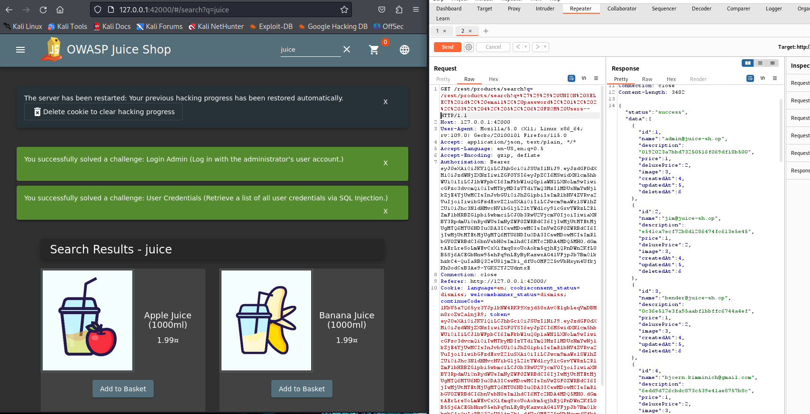

# Group_4 Web Application: XSS & SQL Injection Proof-of-Concept

This project has the aim and objective to Identify an exploit (in a controlled lab web app) XSS and/or SQL Injection vulnerabilities and provide remediation guidance and test cases.

**Required Tools & Lab Setup:**
- [OWASP Juice Shop](https://owasp.org/www-project-juice-shop/) or similar intentionally vulnerable app.
- Pre-built Cisco Kali Linux Virtual Machine
- Oracle Virtualbox V. 7.2.4 
- OWASP Juice Shop V. 16.0.1
- Burp Suite Community edition V. 2023.7.3
- SQLmap 1.7.8
  
## Overview
OWASP Juice Shop was used for this project, it offers a vast amount of different attack vectors to be explored and exploited. However we have chosen to highlight some of the XSS and SQL Injection exploits because they are some of the most well known in the area of Web Application attacks. 

### Authors
- Hampus Rodian
- William Mattsson
- David Thornberg
- Kristijan Danilovic Labudovic

## Introduction
This project aims to explore and demonstrate two well known vulnerabilities in web security: Cross-site Scripting (XSS) and SQL injection (SQLi). By working in a controlled lab environment, based on Juice Shop by OWASP also supplemented with tools in Kali Linux such as Burp Suite and SQLmap, we were able to identify and document real time vulnerabilities without risking real systems or data.

We began by systematically exploring the application to understand its structure and potential weak points. Initial tests included simple payloads and injections to see how the system responded. During this process, we came across a guide that highlighted several relevant challenges. And soon after we discovered a page called “score-board” where all of the challenges are listed. By using this along with the other sources we were able to identify specific security issues and better understand where the vulnerabilities were located.

The work combines both technical analysis with a security approach. We conducted reconnaissance of the application’s functions, we tested different entry points and built secure, minimal proof-of-concepts that demonstrate the impact of a vulnerability. In addition to the testing, we also shifted focus to how these issues can be fixed. Which included creating clear examples of secure solutions, such as using parameterized queries, input validation, and safe output handling. We also prepared test cases that developers can use to reproduce the vulnerabilities and confirm that the fixes actually work.

Overall, the project results in a practical and well documented walkthrough of how SQLi and XSS can be discovered, exploited in a safe manner, and then properly mitigated. The goal was not only to show how these attacks work in practice, but also to enhance ourunderstanding of secure development principles and what developers can do to protect modern web applications from similar issues.

## 2 Methodology
To do this project we used a practical, experiment-based approach. All testing was done in a
controlled lab environment on the OWASP Juice Shop application.
## 3 Findings and Results
This section summarises the vulnerabilities we discovered in Juice Shop, including multiple instances of both XSS and SQL Injection across different pages and functions.
### 3.1 SQLMap
SQLmap was used to a small extent, and what it does is identifies and confirms SQL infection vulnerabilities in Juice shop automatically. We first did it manually using burp suite and simple payloads, then we executed SQLMap commands to see what it would detect automatically, it mapped out some parameters that were injectable, and solved a challenge “error handling”. It demonstrated basic “GET” parameters but nothing that could be used for exploitation. We mainly used SQLmap to compare the automated scanning with the manual testing we did. The goal was to see how much it could detect on its own, and we got a little better understanding of the automated tools and manual SQL injection testing.

**Impact:**
SQLMap showed that partial automated detection can reveal sensitive backend data and confirm different injections points. In a real scenario an attacker could use automated tools like this to scan and exploit SQL injection flaws at websites.

**Mitigation:**
- Use parameterized SQL queries: Makes it so the database treat all user input as text only, so it can’t be interpreted as a command
- Validate user input on the server: check what users send, blocks anything suspicious or with strange characters
- Show simple error messages so if something goes wrong it doesn't give the attackers detailed database errors, just a generic message.

### 3.2 Cross-Site Scripting (XSS)
#### Bonus Payload
In this challenge, the Juice Shop application accepted user controlled HTML that was not sanitized before being stored or displayed. By submitting an iframe element that embedded external content, the browser executed and rendered it directly on the page. This confirmed that the site allowed unfiltered HTML injection, which is a form of stored Cross-Site Scripting (XSS).

**Impact:**
- Any visitor to the affected page would automatically load and execute external content.
- Attackers could replace the harmless SoundCloud iframe with malicious JavaScript to steal session information, perform unwanted actions, or modify the user interface.
- In a real system, this could lead to the account being compromised, phishing attacks, or full browser-side control over the victims session.

**Mitigation:**
- Sanitize and validate all user supplied HTML before storing or displaying it.
- Use a strict allowlist of permitted tags (e.g., only plain text).
- Apply output encoding to ensure that special characters are not interpreted as code.

**Instructions:**
```javascript
<iframe width="100%" height="166" scrolling="no" frameborder="no" allow="autoplay"
src="https://w.soundcloud.com/player/?url=https%3A//api.soundcloud.com/tracks/
6&color=%23ff5500&auto_play=true&hide_related=false&show_comments=true&show_us
er=true&show_reposts=false&show_teaser=true"></iframe>
```
### 3.3 Stored XSS
#### Product review
One page in the Juice shop was vulnerable to stored XSS which was the product review section. When we left a review containing a `<script>` tag, the application saved our input directly into the database. When the product page was reloaded again, the browser executed our script for every user viewing that product. Which confirmed that the application stored user input without sanitizing or encoding it.

**Impact:**
Any user who opens the affected product page will run the attacker’s script. This can be used to steal cookies, redirect the user, change the UI, or perform actions on someone else's behalf.

**Mitigation:**
Validate and sanitize all user input before storing it. Apply proper output encoding when displaying text that comes from the database.

**Command:**
```javascript 
<iframe src="javascript:alert('xss')">
```
### 3.4 DOM XSS
```javascript 
<iframe src="javascript:alert('xss')">
```
**Search Field:**
The search bar was vulnerable to DOM-based Cross-Site Scripting. Injected JavaScript could be directly executed in the browser due to unsafe handling of the query parameter in client-side JavaScript.

**Impact:**
Allows execution of scripts in the victims browser. Could be used to steal session data, perform unauthorized actions, or completely deface the UI.

**Mitigation:**
Avoid inserting user controlled input into the DOM without escaping. Apply context aware output encoding and use libraries or frameworks that handle sanitization automatically.

**Command:**
```javascript
<iframe src="javascript:alert('xss')">
```
### 3.5 SQL Injection (SQLi)
#### Login as Admin
When we tested the login functionality, we discovered that the authentication endpoint was vulnerable to SQL injection. By sending payloads into the username field, the application then returned a valid administrator session. Which confirmed that user supplied data was being inserted directly into the SQL query.

**Impact:**
Attackers can log in as any user, including administrator which gives full control over the system.

**Mitigation:**
To mitigate this attack use parameterized SQL queries (prepared statements), validate and sanitize user input, also ensure that no SQL keywords or operators are executed as plain text.

**Instructions:**
```SQL
' OR 1=1-- as username
hej - as password.
```
#### Product search
The product search function (/rest/products/search) also had issues with SQL injection. You could change the value of the search parameter, which made the database return information that was never supposed to be shown, such as more products and internal database fields.

**Impact:**
Attackers can read information they never should have access to. In a real system, this could lead to full database exposure.

**Mitigation:**
Use parameterized queries, also validate the search input and never insert raw user input into SQL statements.

**Instruction:**
In burpsuite: GET /rest/products/search?q='))-- HTTP/1.

### 3.6 Product Search - SQL Injection
The product search endpoint (/rest/products/search) was vulnerable to SQL injection through the q parameter. By manipulating this value, we were able to make the backend return information that should not be visible to normal users, including hidden products and user information.

At first, simple payloads such as `‘ OR 1=1– ` did not work. To bypass this, we used a URL encoder to transform the payload into an encoded format that the application accepted. Once encoded and sent through burp suite, the backend executed the injected SQL query and returned the sensitive data. This later helped us to order the Christmas drink from 2014, and we used the user information we retrieved to login as Jim and Bender.

**Impact:**
Attackers can retrieve information they should not have access to. In a real system, this could lead to full database exposure.

**Mitigation:**
Use prepared statements and whitelisted search patterns. Never directly put user input into SQL queries.

**Instructions:**
```
In Burp Suite:
GET /rest/products/search?q=%27%29%29%20UNION%20SELECT%20id%2C%20email%2C%20password%2C%20%274%27%2C%20%275%27%2C%20%276%27%2C%20%277%%2C%20%278%27%2C%20%279%27%20FROM%20Users-- HTTP/1.1
```
This is the same as: “q=')) UNION SELECT id, email, password, '4', '5', '6', '7', '8', '9' FROM Users”

#### Track Order API
The track order functionality (/rest/track-order/`<id>`) was vulnerable to SQL injection. The order ID parameter was inserted directly into a SQL query without validation. By appending SQL control characters to the order number in the URL, the database query could be manipulated.

**Impact:**
An attacker can alter the SQL query executed by the application. In a real system, this could lead to:
- exposure of other users order information
- SQL errors that leak database structure
- possible leak of sensitive data

**Mitigation:**
- Use parameterized SQL queries for everything that deals with the database
- Validate the order ID so that only the expected format is accepted.
- Implement generic error messages so SQL errors do not reveal backend details.

**Instructions:**
```
In Burp Suite:
GET /rest/track-order/5267-6f6928d0e342ac97' HTTP/1.1
```
### 3.7 Login Bypass (Jim & Bender):
The login mechanism was vulnerable to SQL injections due to unsafe string concatenation in the authentication query. By injecting SQL comment markers and operators into the username field, it was possible to terminate the original WHERE clause and force asuccessful login without knowing the password. This allowed authentication as users such as Jim and/or Bender.

**Impact:**
- Full account takeover without credentials
- Access to personal information, order history, and account settings.
- Ability to impersonate any user in the system.
- In a real world environment, this would result in complete compromise of the authentication process.

**Mitigation:**
- Use parameterized queries for all authentication.
- Sanitize or block SQL control characters (‘, “, ;, --) in input fields
- Provide generic error responses to avoid exposing database syntax
- Implement robust password handling.

**Instruction:**
```
Login as Bender:
email: bender@juice-sh.op'--
password: a
```
```
Login as Jim:
email: jim@juice-sh.op'--
password: a
```
## 4 What didn’t work

Reflected XSS was one of the attacks we never succeeded with. We tried different payloads in several fields, especially in the customer feedback form, but nothing ever triggered. Even when we submitted scripts and then went to the “About Us” page to read the feedback, it didn't trigger. The alert never appeared, which is strange, but however, things change, versions can differ and some parts may have been updated or patched.

Another challenge we were not able to succeed with was CSP Bypass. We tried different types of XSS-payloads, but when we did we didn’t manage to get it to complete the challenge.

We tried working with different input fields in Juice Shop and through manual requests in Burp Suite, but the result was always pretty similar. It could be because the CSP seemed to be more stricter than the guides that we found online, the older versions of the challenge were easier to bypass. It could be that the CSP config has been updated or changed.

# 5 Conclusion
During the project we often returned to vulnerabilities we had discovered earlier, and this turned out to be very useful. Every time one of us found something interesting we wrote it down in a shared document. We often returned to that document for the rest of the project.

One example was when we couldn't figure out how to purchase the Xmas Special. We tried to find the SQL request for adding a product to the basket, but nothing showed up. So we tried some different things, until one of us remembered that the search page was very vulnerable. So when we searched for “Juice” then added a product into the basket we got the request we were looking for.

From there everything started to make sense. We really began to understand the purpose of the website and how the different vulnerabilities connected. We saw how a single weak spot in a system could be a highway for an attacker, allowing them to bypass normal functionality and reach areas they shouldn’t be able to reach.

## References
[VirtualBox](https://www.virtualbox.org/)

[URL Decoder](https://www.urldecoder.org/)

[LLM Studio](https://lmstudio.ai/)

[Pre-Made Cisco ethical hacker kali download](https://www.netacad.com/resources/lab-downloads?courseLang=en-US)

[Juice shop guide](https://pwning.owasp-juice.shop/companion-guide/latest/appendix/solutions.html)
